# 四、随机化 SVD

## 第一部分：随机投影（使用词向量）

本节的目的是用单词向量的具体例子，来说明随机投影保留结构的想法！

要在机器学习中使用语言（例如，Skype 翻译器如何在语言之间进行翻译，或 Gmail 智能回复如何自动为你的电子邮件建议可能的回复），我们需要将单词表示为向量。

我们可以使用 Google 的 Word2Vec 或 Stanford 的 GloVe 将单词表示为 100 维向量。 例如，这里是“python”这个词在 GloVe 中的向量：

```py
vecs[wordidx['python']]

'''
array([ 0.2493,  0.6832, -0.0447, -1.3842, -0.0073,  0.651 , -0.3396,
       -0.1979, -0.3392,  0.2669, -0.0331,  0.1592,  0.8955,  0.54  ,
       -0.5582,  0.4624,  0.3672,  0.1889,  0.8319,  0.8142, -0.1183,
       -0.5346,  0.2416, -0.0389,  1.1907,  0.7935, -0.1231,  0.6642,
       -0.7762, -0.4571, -1.054 , -0.2056, -0.133 ,  0.1224,  0.8846,
        1.024 ,  0.3229,  0.821 , -0.0694,  0.0242, -0.5142,  0.8727,
        0.2576,  0.9153, -0.6422,  0.0412, -0.6021,  0.5463,  0.6608,
        0.198 , -1.1393,  0.7951,  0.4597, -0.1846, -0.6413, -0.2493,
       -0.4019, -0.5079,  0.8058,  0.5336,  0.5273,  0.3925, -0.2988,
        0.0096,  0.9995, -0.0613,  0.7194,  0.329 , -0.0528,  0.6714,
       -0.8025, -0.2579,  0.4961,  0.4808, -0.684 , -0.0122,  0.0482,
        0.2946,  0.2061,  0.3356, -0.6417, -0.6471,  0.1338, -0.1257,
       -0.4638,  1.3878,  0.9564, -0.0679, -0.0017,  0.5296,  0.4567,
        0.6104, -0.1151,  0.4263,  0.1734, -0.7995, -0.245 , -0.6089,
       -0.3847, -0.4797], dtype=float32)
'''
```

目标：使用随机性将此值从 100 维减少到 20。检查相似的单词是否仍然组合在一起。

更多信息：如果你对词嵌入感兴趣并想要更多细节，我在[这里](https://www.youtube.com/watch?v=25nC0n9ERq4)提供了一个更长的学习小组（带有[代码演示](https://github.com/fastai/word-embeddings-workshop)）。

风格说明：我使用[可折叠标题](http://jupyter-contrib-nbextensions.readthedocs.io/en/latest/nbextensions/collapsible_headings/readme.html)和 [jupyter 主题](https://github.com/dunovank/jupyter-themes)。

### 加载数据

```py
import pickle
import numpy as np
import re
import json

np.set_printoptions(precision=4, suppress=True)
```

该数据集可从[这里](http://files.fast.ai/models/glove/6B.100d.tgz)获得。要从命令行下载和解压缩文件，你可以运行：

```
wget http://files.fast.ai/models/glove_50_glove_100.tgz 
tar xvzf glove_50_glove_100.tgz
```

你需要更新以下路径，来指定存储数据的位置。

```py
path = "../data/"

vecs = np.load(path + "glove_vectors_100d.npy")

with open(path + "words.txt") as f:
    content = f.readlines()
words = [x.strip() for x in content] 

wordidx = json.load(open(path + "wordsidx.txt"))
```

### 我们的数据的样子

我们有一个单词的长列表。

```py
len(words)

# 400000

words[:10]

# ['the', ',', '.', 'of', 'to', 'and', 'in', 'a', '"', "'s"]

words[600:610]

'''
['together',
 'congress',
 'index',
 'australia',
 'results',
 'hard',
 'hours',
 'land',
 'action',
 'higher']
'''
```

`wordidx`允许我们查找单词来找出它的索引：

```py
wordidx['python']

# 20019

words[20019]

# 'python'
```

### 作为向量的单词

单词“python”由 100 维向量表示：

```py
vecs[wordidx['python']]

'''
array([ 0.2493,  0.6832, -0.0447, -1.3842, -0.0073,  0.651 , -0.3396,
       -0.1979, -0.3392,  0.2669, -0.0331,  0.1592,  0.8955,  0.54  ,
       -0.5582,  0.4624,  0.3672,  0.1889,  0.8319,  0.8142, -0.1183,
       -0.5346,  0.2416, -0.0389,  1.1907,  0.7935, -0.1231,  0.6642,
       -0.7762, -0.4571, -1.054 , -0.2056, -0.133 ,  0.1224,  0.8846,
        1.024 ,  0.3229,  0.821 , -0.0694,  0.0242, -0.5142,  0.8727,
        0.2576,  0.9153, -0.6422,  0.0412, -0.6021,  0.5463,  0.6608,
        0.198 , -1.1393,  0.7951,  0.4597, -0.1846, -0.6413, -0.2493,
       -0.4019, -0.5079,  0.8058,  0.5336,  0.5273,  0.3925, -0.2988,
        0.0096,  0.9995, -0.0613,  0.7194,  0.329 , -0.0528,  0.6714,
       -0.8025, -0.2579,  0.4961,  0.4808, -0.684 , -0.0122,  0.0482,
        0.2946,  0.2061,  0.3356, -0.6417, -0.6471,  0.1338, -0.1257,
       -0.4638,  1.3878,  0.9564, -0.0679, -0.0017,  0.5296,  0.4567,
        0.6104, -0.1151,  0.4263,  0.1734, -0.7995, -0.245 , -0.6089,
       -0.3847, -0.4797], dtype=float32)
'''
```

这让我们可以做一些有用的计算。 例如，我们可以使用距离度量，看到两个单词有多远：

```py
from scipy.spatial.distance import cosine as dist
```

较小的数字意味着两个单词更接近，较大的数字意味着它们更加分开。

相似单词之间的距离很短：

```py
dist(vecs[wordidx["puppy"]], vecs[wordidx["dog"]])

# 0.27636240676695256

dist(vecs[wordidx["queen"]], vecs[wordidx["princess"]])

# 0.20527545040329642
```

并且无关词之间的距离很高：

```py
dist(vecs[wordidx["celebrity"]], vecs[wordidx["dusty"]])

# 0.98835787578057777

dist(vecs[wordidx["avalanche"]], vecs[wordidx["antique"]])

# 0.96211070091611983
```

### 偏见

有很多偏见的机会：

```py
dist(vecs[wordidx["man"]], vecs[wordidx["genius"]])

# 0.50985148631697985

dist(vecs[wordidx["woman"]], vecs[wordidx["genius"]])

# 0.6897833082810727
```

我只是检查了几对词之间的距离，因为这是说明这个概念的快速而简单的方式。 这也是一种非常嘈杂的方法，研究人员用更系统的方式解决这个问题。

我在这个学习小组上更深入地讨论了偏见。


### 可视化

让我们可视化一些单词！

我们将使用 Plotly，一个制作交互式图形的 Python 库（注意：以下所有内容都是在不创建帐户的情况下完成的，使用免费的离线版 Plotly）。

### 方法

```py
import plotly
import plotly.graph_objs as go    
from IPython.display import IFrame

def plotly_3d(Y, cat_labels, filename="temp-plot.html"):
    trace_dict = {}
    for i, label in enumerate(cat_labels):
        trace_dict[i] = go.Scatter3d(
            x=Y[i*5:(i+1)*5, 0],
            y=Y[i*5:(i+1)*5, 1],
            z=Y[i*5:(i+1)*5, 2],
            mode='markers',
            marker=dict(
                size=8,
                line=dict(
                    color='rgba('+ str(i*40) + ',' + str(i*40) + ',' + str(i*40) + ', 0.14)',
                    width=0.5
                ),
                opacity=0.8
            ),
            text = my_words[i*5:(i+1)*5],
            name = label
        )

    data = [item for item in trace_dict.values()]
    layout = go.Layout(
        margin=dict(
            l=0,
            r=0,
            b=0,
            t=0
        )
    )

    plotly.offline.plot({
        "data": data,
        "layout": layout,
    }, filename=filename)

def plotly_2d(Y, cat_labels, filename="temp-plot.html"):
    trace_dict = {}
    for i, label in enumerate(cat_labels):
        trace_dict[i] = go.Scatter(
            x=Y[i*5:(i+1)*5, 0],
            y=Y[i*5:(i+1)*5, 1],
            mode='markers',
            marker=dict(
                size=8,
                line=dict(
                    color='rgba('+ str(i*40) + ',' + str(i*40) + ',' + str(i*40) + ', 0.14)',
                    width=0.5
                ),
                opacity=0.8
            ),
            text = my_words[i*5:(i+1)*5],
            name = label
        )

    data = [item for item in trace_dict.values()]
    layout = go.Layout(
        margin=dict(
            l=0,
            r=0,
            b=0,
            t=0
        )
    )

    plotly.offline.plot({
        "data": data,
        "layout": layout
    }, filename=filename)
```

此方法将挑选出 3 个维度，最能将我们的类别彼此分开（存储在`dist_btwn_cats`中），同时最小化给定类别中单词的距离（存储在`dist_within_cats`中）。

```py
def get_components(data, categories, word_indices):
    num_components = 30
    pca = decomposition.PCA(n_components=num_components).fit(data.T)
    all_components = pca.components_
    centroids = {}
    print(all_components.shape)
    for i, category in enumerate(categories):
        cen = np.mean(all_components[:, i*5:(i+1)*5], axis = 1)
        dist_within_cats = np.sum(np.abs(np.expand_dims(cen, axis=1) - all_components[:, i*5:(i+1)*5]), axis=1)
        centroids[category] = cen
    dist_btwn_cats = np.zeros(num_components)
    for category1, averages1 in centroids.items():
        for category2, averages2 in centroids.items():
            dist_btwn_cats += abs(averages1 - averages2)
            clusterness = dist_btwn_cats / dist_within_cats
    comp_indices = np.argpartition(clusterness, -3)[-3:]
    return all_components[comp_indices]
```

### 准备数据

让我们绘制几个不同类别的单词：

```py
my_words = [
            "maggot", "flea", "tarantula", "bedbug", "mosquito", 
            "violin", "cello", "flute", "harp", "mandolin",
            "joy", "love", "peace", "pleasure", "wonderful",
            "agony", "terrible", "horrible", "nasty", "failure", 
            "physics", "chemistry", "science", "technology", "engineering",
            "poetry", "art", "literature", "dance", "symphony",
           ]

categories = [
              "bugs", "music", 
              "pleasant", "unpleasant", 
              "science", "arts"
             ]
```

同样，我们需要使用`wordidx`字典查找单词的索引：

```py
my_word_indices = np.array([wordidx[word] for word in my_words])

vecs[my_word_indices].shape

# (30, 100)
```

现在，我们将组合我们的单词与我们整个单词集中的前 10,000 个单词（其中一些单词已经存在），并创建嵌入矩阵。

```py
embeddings = np.concatenate((vecs[my_word_indices], vecs[:10000,:]), axis=0); embeddings.shape

# (10030, 100)
```

### 在 3D 中查看单词

单词有 100 个维度，我们需要一种在 3D 中可视化它们的方法。

我们将使用主成分分析（PCA），这是一种广泛使用的技术，具有许多应用，包括在较低维度可视化高维数据集！

### PCA

```py
from collections import defaultdict
from sklearn import decomposition

components = get_components(embeddings, categories, my_word_indices)
plotly_3d(components.T[:len(my_words),:], categories, "pca.html")

# (30, 10030)

IFrame('pca.html', width=600, height=400)
```

### 随机投影

Johnson-Lindenstrauss 引理：（来自维基百科）高维空间中的一小组点可以嵌入到更低维度的空间中，使点之间的距离几乎保留（使用随机投影证明）。

有用的是，能够以保持距离的方式减少数据的维度。 Johnson-Lindenstrauss 引理是这种类型的经典结果。

```py
embeddings.shape

# (10030, 100)

rand_proj = embeddings @ np.random.normal(size=(embeddings.shape[1], 40)); rand_proj.shape

# (10030, 40)

# pca = decomposition.PCA(n_components=3).fit(rand_proj.T)
# components = pca.components_
components = get_components(rand_proj, categories, my_word_indices)
plotly_3d(components.T[:len(my_words),:], categories, "pca-rand-proj.html")

# (30, 10030)

IFrame('pca-rand-proj.html', width=600, height=400)
```

## 第二部分：用于背景消除的随机 SVD

我们今天的目标：


### 加载和格式化数据

让我们使用 BMC 2012 背景模型挑战数据集中的真实视频 003。

导入所需的库：

```py
import imageio
imageio.plugins.ffmpeg.download()

import moviepy.editor as mpe
import numpy as np
import scipy

%matplotlib inline
import matplotlib.pyplot as plt

scale = 0.50   # 调整比例来更改图像的分辨率
dims = (int(240 * scale), int(320 * scale))
fps = 60      # 每秒的帧

M = np.load("movie/med_res_surveillance_matrix_60fps.npy")

print(dims, M.shape)

# (120, 160) (19200, 6000)

plt.imshow(np.reshape(M[:,140], dims), cmap='gray');
```


```py
plt.figure(figsize=(12, 12))
plt.imshow(M, cmap='gray')

# <matplotlib.image.AxesImage at 0x7f601f315fd0>
```


将来，你可以加载已保存的内容：

```py
U = np.load("U.npy")
s = np.load("s.npy")
V = np.load("V.npy")
```

`U, S, V`是什么样呢？

```py
U.shape, s.shape, V.shape

# ((19200, 6000), (6000,), (6000, 6000))
```

检查它们是`M`的分解。

```py
reconstructed_matrix = U @ np.diag(s) @ V

np.allclose(M, reconstructed_matrix)

# True
```

是的。

### 移除背景

```py
low_rank = np.expand_dims(U[:,0], 1) * s[0] * np.expand_dims(V[0,:], 0)

plt.figure(figsize=(12, 12))
plt.imshow(low_rank, cmap='gray')

# <matplotlib.image.AxesImage at 0x7f1cc3e2c9e8>
```


```py
plt.imshow(np.reshape(low_rank[:,0], dims), cmap='gray');
```


我们如何获取里面的人？

```py
plt.imshow(np.reshape(M[:,0] - low_rank[:,0], dims), cmap='gray');
```

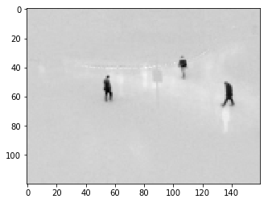

### SVD 对不同大小的矩阵的速度

`s`是对角矩阵的对角线。

```py
np.set_printoptions(suppress=True, precision=4)

import timeit
import pandas as pd

m_array = np.array([100, int(1e3), int(1e4)])
n_array = np.array([100, int(1e3), int(1e4)])

index = pd.MultiIndex.from_product([m_array, n_array], names=['# rows', '# cols'])

pd.options.display.float_format = '{:,.3f}'.format
df = pd.DataFrame(index=m_array, columns=n_array)

# %%prun
for m in m_array:
    for n in n_array:      
        A = np.random.uniform(-40,40,[m,n])  
        t = timeit.timeit('np.linalg.svd(A, full_matrices=False)', number=3, globals=globals())
        df.set_value(m, n, t)

df/3
```

|  | 100 | 1000 | 10000 |
| --- | --- | --- | --- |
| 100 | 0.006 | 0.009 | 0.043 |
| 1000 | 0.004 | 0.259 | 0.992 |
| 10000 | 0.019 | 0.984 | 218.726 |

很好！！！但是...

缺点：这真的很慢（同样，我们摒弃了很多计算）。

```py
%time u, s, v = np.linalg.svd(M, full_matrices=False)

'''
CPU times: user 5min 38s, sys: 1.53 s, total: 5min 40s
Wall time: 57.1 s
'''

M.shape

# (19200, 6000)
```

### 随机化 SVD 的最简单版本

想法：让我们使用更小的矩阵！

我们还没有找到更好的通用 SVD 方法，我们只会使用我们在较小矩阵上使用的方法，该矩阵与原始矩阵的范围大致相同。

```py
def simple_randomized_svd(M, k=10):
    m, n = M.shape
    transpose = False
    if m < n:
        transpose = True
        M = M.T
        
    rand_matrix = np.random.normal(size=(M.shape[1], k))  # short side by k
    Q, _ = np.linalg.qr(M @ rand_matrix, mode='reduced')  # long side by k
    smaller_matrix = Q.T @ M                              # k by short side
    U_hat, s, V = np.linalg.svd(smaller_matrix, full_matrices=False)
    U = Q @ U_hat
    
    if transpose:
        return V.T, s.T, U.T
    else:
        return U, s, V

%time u, s, v = simple_randomized_svd(M, 10)

'''
CPU times: user 3.06 s, sys: 268 ms, total: 3.33 s
Wall time: 789 ms
'''

U_rand, s_rand, V_rand = simple_randomized_svd(M, 10)

low_rank = np.expand_dims(U_rand[:,0], 1) * s_rand[0] * np.expand_dims(V_rand[0,:], 0)

plt.imshow(np.reshape(low_rank[:,0], dims), cmap='gray');
```

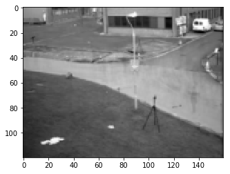

我们如何获取里面的人？

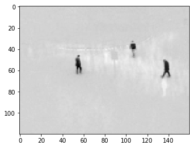

### 这个方法在做什么

```py
rand_matrix = np.random.normal(size=(M.shape[1], 10))

rand_matrix.shape

# (6000, 10)

plt.imshow(np.reshape(rand_matrix[:4900,0], (70,70)), cmap='gray');
```

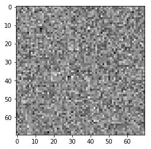

```py
temp = M @ rand_matrix; temp.shape

# (19200, 10)

plt.imshow(np.reshape(temp[:,0], dims), cmap='gray');
```


```py
plt.imshow(np.reshape(temp[:,1], dims), cmap='gray');
```

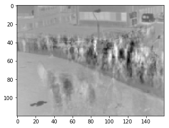

```py
Q, _ = np.linalg.qr(M @ rand_matrix, mode='reduced'); Q.shape

# (19200, 10)

np.dot(Q[:,0], Q[:,1])

# -3.8163916471489756e-17

plt.imshow(np.reshape(Q[:,0], dims), cmap='gray');
```

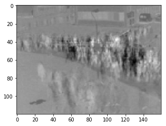

```py
plt.imshow(np.reshape(Q[:,1], dims), cmap='gray');
```

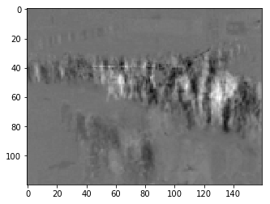

```py
smaller_matrix = Q.T @ M; smaller_matrix.shape

# (10, 6000)

U_hat, s, V = np.linalg.svd(smaller_matrix, full_matrices=False)

U = Q @ U_hat

plt.imshow(np.reshape(U[:,0], dims), cmap='gray');
```

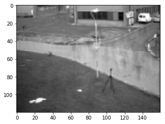

```py
reconstructed_small_M = U @ np.diag(s) @ V
```

以及人。

```py
plt.imshow(np.reshape(M[:,0] - reconstructed_small_M[:,0], dims), cmap='gray');
```

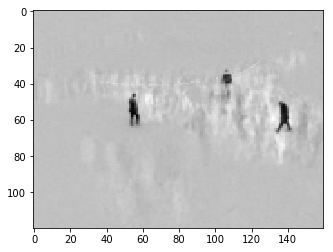

### 时间比较

```py
from sklearn import decomposition
import fbpca
```

完整的 SVD：

```py
%time u, s, v = np.linalg.svd(M, full_matrices=False)

'''
CPU times: user 5min 38s, sys: 1.53 s, total: 5min 40s
Wall time: 57.1 s
'''
```

我们的（过度简化）的`randomized_svd`：

```py
%time u, s, v = simple_randomized_svd(M, 10)

'''
CPU times: user 2.37 s, sys: 160 ms, total: 2.53 s
Wall time: 641 ms
'''
```

Sklearn：

```py
%time u, s, v = decomposition.randomized_svd(M, 10)

'''
CPU times: user 19.2 s, sys: 1.44 s, total: 20.7 s
Wall time: 3.67 s
'''
```

来自 Facebook fbpca 库的随机 SVD：

```py
%time u, s, v = fbpca.pca(M, 10)

'''
CPU times: user 7.28 s, sys: 424 ms, total: 7.7 s
Wall time: 1.37 s
'''
```

我会选择 fbpca，因为它比 sklearn 更快，比我们简单的实现更健壮，更准确。

以下是 Facebook Research 的一些结果：

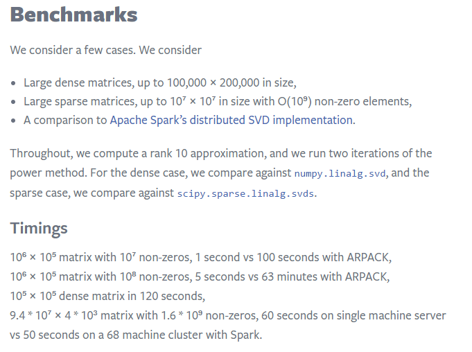

### `k`变化下的时间和准确度

```py
import timeit
import pandas as pd

U_rand, s_rand, V_rand = fbpca.pca(M, 700, raw=True)
reconstructed = U_rand @ np.diag(s_rand) @ V_rand

np.linalg.norm(M - reconstructed)

# 1.1065914828881536e-07

plt.imshow(np.reshape(reconstructed[:,140], dims), cmap='gray');
```

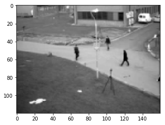

```py
pd.options.display.float_format = '{:,.2f}'.format
k_values = np.arange(100,1000,100)
df_rand = pd.DataFrame(index=["time", "error"], columns=k_values)

# df_rand = pd.read_pickle("svd_df")

for k in k_values:
    U_rand, s_rand, V_rand = fbpca.pca(M, k, raw=True)
    reconstructed = U_rand @ np.diag(s_rand) @ V_rand
    df_rand.set_value("error", k, np.linalg.norm(M - reconstructed))
    t = timeit.timeit('fbpca.pca(M, k)', number=3, globals=globals())
    df_rand.set_value("time", k, t/3)

df_rand.to_pickle("df_rand")

df_rand
```

|  | 100 | 200 | 300 | 400 | 500 | 600 | 700 | 800 | 900 | 1000 |
| --- | --- | --- | --- | --- | --- | --- | --- | --- | --- | --- |
| time | 2.07 | 2.57 | 3.45 | 6.44 | 7.99 | 9.02 | 10.24 | 11.70 | 13.30 | 10.87 |
| error | 58,997.27 | 37,539.54 | 26,569.89 | 18,769.37 | 12,559.34 | 6,936.17 | 0.00 | 0.00 | 0.00 | 0.00 |

```py
df = pd.DataFrame(index=["error"], columns=k_values)

for k in k_values:
    reconstructed = U[:,:k] @ np.diag(s[:k]) @ V[:k,:]
    df.set_value("error", k, np.linalg.norm(M - reconstructed))

df.to_pickle("df")

fig, ax1 = plt.subplots()
ax1.plot(df.columns, df_rand.loc["time"].values, 'b-', label="randomized SVD time")
ax1.plot(df.columns, np.tile([57], 9), 'g-', label="SVD time")
ax1.set_xlabel('k: # of singular values')
# Make the y-axis label, ticks and tick labels match the line color.
ax1.set_ylabel('time', color='b')
ax1.tick_params('y', colors='b')
ax1.legend(loc = 0)

ax2 = ax1.twinx()
ax2.plot(df.columns, df_rand.loc["error"].values, 'r--', label="randomized SVD error")
ax2.plot(df.columns, df.loc["error"].values, 'm--', label="SVD error")
ax2.set_ylabel('error', color='r')
ax2.tick_params('y', colors='r')
ax2.legend(loc=1)

#fig.tight_layout()
plt.show()
```

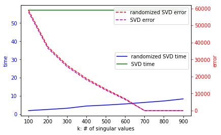

### 数学细节

### 随机 SVD 背后的处理

下面是一个计算截断 SVD 的过程，在“[带有随机性的搜索结构：用于构造近似矩阵分解的概率算法](https://arxiv.org/pdf/0909.4061.pdf)”中描述，并在[此博客文章](https://research.fb.com/fast-randomized-svd/)中总结：

1.计算`A`的近似范围。也就是说，我们希望`Q`具有`r`个正交列，使得：


2.构造 ，它比较小`r×n`。

3.通过标准方法计算`B`的 SVD（因为`B`小于`A`所以更快），。

4. 由于：


如果我们设置`U = QS`，那么我们有一个低秩的近似值 。

### 那么我们如何找到`Q`（步骤 1）？

为了估计`A`的范围，我们可以只取一堆随机向量 $w_i$，来求解 $Aw_i$ 形成的子空间。 我们可以用 $w_i$ 作为列来形成矩阵`W`。 现在，我们采用`AW = QR`的 QR 分解，然后`Q`的列形成`AW`的标准正交基，这是`A`的范围。

由于乘积矩阵`AW`的行比列更多，因此列大致正交。 这是一个简单的概率 - 有很多行，列很少，列不可能是线性相关的。

### 为什么 $M \sim Q Q^T M$

我们试图找到矩阵`Q`，使得 $M \approx  QQ^TM$。 我们对`M`的范围很感兴趣，我们称之为`MX`。 `Q`有正交列，因此 $Q^TQ = I$（但 $QQ^T$ 不是`I`，因为`Q`是矩形的）。

$QR=MX \\ QQ^TQR=QQ^TMX \\ QR=QQ^TMX$

于是...

$MX=QQ^TMX$

如果`X`是单位，我们就做成了（但是`X`会太大，我们不会得到我们想要的加速）。 在我们的问题中，`X`只是一个小的随机矩阵。 Johnson-Lindenstrauss 引理为其工作原理提供了一些理由。

### QR 分解

我们稍后将深入了解QR分解。 现在，你只需要知道`A = QR`，其中`Q`由正交列组成，`R`是上三角形。 Trefethen 说 QR 分解是数值线性代数中最重要的思想！ 我们一定会将回顾它。

我们该如何选择`r`？
假设我们的矩阵有 100 列，我们想要`U`和`V`中的5列。为了安全起见，我们应该将矩阵投影到正交基上，其中的行数和列数多于 5（让我们使用 15）。 最后，我们取`U`和`V`的前 5 列。

因此，即使我们的投影只是近似的，通过使它比我们需要的更大，我们可以弥补精度的损失（因为我们随后只采用了一个子集）。

### 这与随机均有何不同

```py
test = M @ np.random.normal(size=(M.shape[1], 2)); test.shape

# (4800, 2)
```

随机均值：

```py
plt.imshow(np.reshape(test[:,0], dims), cmap='gray');
```

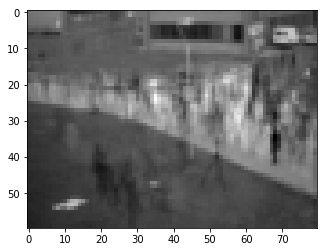

均值图像：

```py
plt.imshow(np.reshape(M.mean(axis=1), dims), cmap='gray')

# <matplotlib.image.AxesImage at 0x7f83f4093fd0>
```

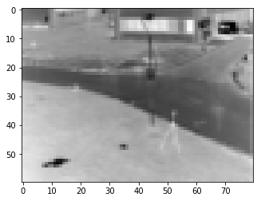

```py
ut, st, vt = np.linalg.svd(test, full_matrices=False)

plt.imshow(np.reshape(smaller_matrix[0,:], dims), cmap='gray');
```


```py
plt.imshow(np.reshape(smaller_matrix[1,:], dims), cmap='gray');
```

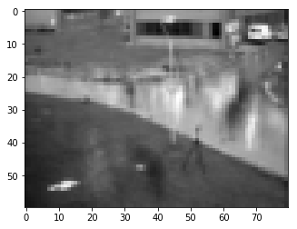

```py
plt.imshow(np.reshape(M[:,140], dims), cmap='gray');
```

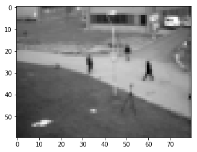

## 第三部分：用于主体建模的随机 SVD

### 随机 SVD

提醒：完整的 SVD 很慢。 这是我们使用 Scipy 的 Linalg SVD 进行的计算：

```py
import numpy as np

vectors = np.load("topics/vectors.npy")

vectors.shape

# (2034, 26576)

%time U, s, Vh = linalg.svd(vectors, full_matrices=False)

'''
CPU times: user 27.2 s, sys: 812 ms, total: 28 s
Wall time: 27.9 s
'''

print(U.shape, s.shape, Vh.shape)

# (2034, 2034) (2034,) (2034, 26576)
```

运行的是，还有更快的方法：

```py
%time u, s, v = decomposition.randomized_svd(vectors, 5)

'''
CPU times: user 144 ms, sys: 8 ms, total: 152 ms
Wall time: 154 ms
'''
```

SVD 的运行时复杂度为`O(min(m^2 n,m n^2))`。

问题：我们如何加快速度？ （没有 SVD 研究的新突破的情况下）。

想法：让我们使用更小的矩阵（`n`更小）！

我们不使用`m×n`的整个矩阵`A`计算 SVD，而是使用`B = AQ`，它只是`m×r`，并且`r << n`。

我们还没有找到更好的 SVD 通用方法，我们只是在较小的矩阵上使用我们的方法。

```py
%time u, s, v = decomposition.randomized_svd(vectors, 5)

'''
CPU times: user 144 ms, sys: 8 ms, total: 152 ms
Wall time: 154 ms
'''

u.shape, s.shape, v.shape

# ((2034, 5), (5,), (5, 26576))

show_topics(v)

'''
['jpeg image edu file graphics images gif data',
 'jpeg gif file color quality image jfif format',
 'space jesus launch god people satellite matthew atheists',
 'jesus god matthew people atheists atheism does graphics',
 'image data processing analysis software available tools display']
'''
```

### 随机 SVD，第二版

```py
from scipy import linalg
```

方法`randomized_range_finder`找到一个正交矩阵，其范围近似于`A`的范围（我们的算法中的步骤 1）。 为此，我们使用 LU 和 QR 分解，我们将在稍后深入介绍这两种分解。

我使用`sklearn.extmath.randomized_svd`源代码作为指南。

```py
# 计算一个正交矩阵，其范围近似于A的范围
# power_iteration_normalizer 可以是 safe_sparse_dot（快但不稳定），LU（二者之间）或 QR（慢但最准确）
def randomized_range_finder(A, size, n_iter=5):
    Q = np.random.normal(size=(A.shape[1], size))
    
    for i in range(n_iter):
        Q, _ = linalg.lu(A @ Q, permute_l=True)
        Q, _ = linalg.lu(A.T @ Q, permute_l=True)
        
    Q, _ = linalg.qr(A @ Q, mode='economic')
    return Q
```

这里是我们的随机 SVD 方法。

```py
def randomized_svd(M, n_components, n_oversamples=10, n_iter=4):
    
    n_random = n_components + n_oversamples
    
    Q = randomized_range_finder(M, n_random, n_iter)
    print(Q.shape)
    # project M to the (k + p) dimensional space using the basis vectors
    B = Q.T @ M
    print(B.shape)
    # compute the SVD on the thin matrix: (k + p) wide
    Uhat, s, V = linalg.svd(B, full_matrices=False)
    del B
    U = Q @ Uhat
    print(U.shape)
    
    return U[:, :n_components], s[:n_components], V[:n_components, :]

u, s, v = randomized_svd(vectors, 5)

'''
(2034, 15)
(15, 26576)
(2034, 15)
'''
```

### 测试

```py
vectors.shape

# (2034, 26576)

Q = np.random.normal(size=(vectors.shape[1], 10)); Q.shape

# (26576, 10)

Q2, _ = linalg.qr(vectors @ Q, mode='economic'); Q2.shape

# (2034, 10)

Q2.shape

# (2034, 10)
```

### 测试结束

```py
%time u, s, v = randomized_svd(vectors, 5)

'''
CPU times: user 136 ms, sys: 0 ns, total: 136 ms
Wall time: 137 ms
'''

u.shape, s.shape, v.shape

# ((2034, 5), (5,), (5, 26576))

show_topics(v)

'''
['jpeg image edu file graphics images gif data',
 'edu graphics data space pub mail 128 3d',
 'space jesus launch god people satellite matthew atheists',
 'space launch satellite commercial nasa satellites market year',
 'image data processing analysis software available tools display']
'''
```

在改变主题数时，写一个循环来计算分解的误差。绘制结果。

### 答案

```py
# 在改变主题数时，写一个循环来计算分解的误差。绘制结果

plt.plot(range(0,n*step,step), error)

# [<matplotlib.lines.Line2D at 0x7fe3f8a1b438>]
```

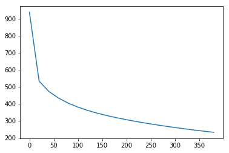

```py
%time u, s, v = decomposition.randomized_svd(vectors, 5)

'''
CPU times: user 144 ms, sys: 8 ms, total: 152 ms
Wall time: 154 ms
'''

%time u, s, v = decomposition.randomized_svd(vectors.todense(), 5)

'''
CPU times: user 2.38 s, sys: 592 ms, total: 2.97 s
Wall time: 2.96 s
'''
```

### 扩展资源

+   [随机算法的整个课程](http://www.cs.ubc.ca/~nickhar/W12/)
