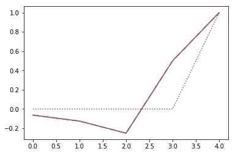
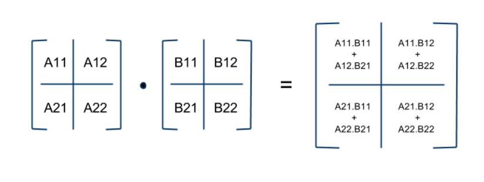

# 五、LR 分解

`fbpca`和我们自己的`randomized_range_finder`方法都使用 LU 分解，它将矩阵分解为下三角矩阵和上三角矩阵的乘积。

### 高斯消元

本节基于 Trefethen 的 20-22 讲座。

如果你不熟悉高斯消元或需要复习，请观看[此可汗学院视频](https://www.khanacademy.org/math/precalculus/precalc-matrices/row-echelon-and-gaussian-elimination/v/matrices-reduced-row-echelon-form-2)。

让我们手动使用高斯消元来回顾：


答案：


以上示例来自 Trefethen 的讲座 20,21。

高斯消元通过在左侧应用线性变换，将线性方程组变换为上三角形方程组。 它是三角形三角化。


`L`是单位下三角形：所有对角线元素都是 1。

```py
def LU(A):
    U = np.copy(A)
    m, n = A.shape
    L = np.eye(n)
    for k in range(n-1):
        for j in range(k+1,n):
            L[j,k] = U[j,k]/U[k,k]
            U[j,k:n] -= L[j,k] * U[k,k:n]
    return L, U

A = np.array([[2,1,1,0],[4,3,3,1],[8,7,9,5],[6,7,9,8]]).astype(np.float)

L, U = LU(A)

np.allclose(A, L @ U)

# True
```

LU分解很有用！

求解`Ax = b`变为`LUx = b`：

+   找到`A = LU`
+   解`Ly = b`
+   解`Ux = y`
+   完事

### 工作量

高斯消元的工作量：

### 内存

在上面，我们创建了两个新的矩阵，`L`和`U`。但是，我们可以将`L`和`U`的值存储在矩阵`A`中（覆盖原始矩阵）。 由于`L`的对角线都是 1，因此不需要存储。 在原地进行因式分解或计算，是数值线性代数中用于节省内存的常用技术。 注意：如果你将来需要再次使用原始矩阵`A`，则不希望这样做。 其中一个作业问题是重写 LU 方法来原地操作。

考虑矩阵：


```py
A = np.array([[1e-20, 1], [1,1]])
```

手动使用高斯消元法计算`L`和`U`：

```py
# 练习：

np.set_printoptions(suppress=True)

# 练习：

L2, U2 = LU(A)

'''
[[  1.00000000e-20   1.00000000e+00]
 [  0.00000000e+00  -1.00000000e+20]]
'''

L2, U2

'''
(array([[  1.00000000e+00,   0.00000000e+00],
        [  1.00000000e+20,   1.00000000e+00]]),
 array([[  1.00000000e-20,   1.00000000e+00],
        [  0.00000000e+00,  -1.00000000e+20]]))
'''

np.allclose(L1, L2)

# True

np.allclose(U1, U2)

# True

np.allclose(A, L2 @ U2)

# False
```

这是使用交换主元进行 LU 分解的动机。

这也说明 LU 分解是稳定的，但不是向后稳定的。 （剧透：即使部分交换主元，LU 对某些矩阵来说“爆炸性不稳定”，但在实践中稳定）

### 稳定性

问题`f`的算法`f^`是稳定的，如果对于每个`x`：


对于一些`y`：


一个稳定的算法几乎可以为几乎正确的问题提供正确的答案（Trefethen，第 104 页）。

翻译：

+   正确的问题：`x`
+   几乎正确的问题：`y`
+   正确答案：`f`
+   几乎正确的问题的正确答案：`f(y)`

### 向后稳定

向后稳定性比稳定性更强大，更简单。

问题`f`的算法`f^`是向后稳定的，如果对于每个`x`，


对于一些`y`：


向后稳定的算法为几乎正确的问题提供了正确的答案（Trefethen，第 104 页）。

翻译：

+   正确的问题：`x`
+   几乎正确的问题：`y`
+   正确答案：`f`
+   几乎正确的问题的正确答案：`f(y)`

### 带有交换主元的 LU 分解

让我们看看矩阵：


```py
A = np.array([[1,1], [1e-20, 1]])
```

手动使用高斯消元法计算`L`和`U`：


```py
L, U = LU(A)

np.allclose(A, L @ U)

# True
```

想法：我们可以切换行的顺序，来获得更稳定的答案！ 这相当于乘以置换矩阵`P`。例如，


对`PA`应用高斯消元。

在每个步骤中，选择列`k`中的最大值，并将该行移动到行`k`。

### 作业

```py
def swap(a,b):
    temp = np.copy(a)
    a[:] = b
    b[:] = temp

a=np.array([1,2,3])
b=np.array([3,2,1])
swap(a,b)
a,b

# 练习：重新编写上面的 LU 分解以使用交换主元
```

### 示例

```py
A = np.array([[2,1,1,0],[4,3,3,1],[8,7,9,5],[6,7,9,8]]).astype(np.float)

L, U, P = LU_pivot(A)
```

可以比较下面 Trefethen，第 159 页的答案：

```py
A

'''
array([[ 2.,  1.,  1.,  0.],
       [ 4.,  3.,  3.,  1.],
       [ 8.,  7.,  9.,  5.],
       [ 6.,  7.,  9.,  8.]])
'''

U

'''
array([[ 8.        ,  7.        ,  9.        ,  5.        ],
       [ 0.        ,  1.75      ,  2.25      ,  4.25      ],
       [ 0.        ,  0.        , -0.28571429,  0.57142857],
       [ 0.        ,  0.        ,  0.        , -2.        ]])
'''

P

'''
array([[ 0.,  0.,  1.,  0.],
       [ 0.,  0.,  0.,  1.],
       [ 1.,  0.,  0.,  0.],
       [ 0.,  1.,  0.,  0.]])
'''
```

部分交换主元可以置换行。 这是一种普遍的做法，这通常是 LU 分解的意思。

完全交换主元可以置换行和列。 完全交换主元非常耗时，很少在实践中使用。

### 示例

考虑方程组：


```py
def make_matrix(n):
    A = np.eye(n)
    for i in range(n):
        A[i,-1] = 1
        for j in range(i):
            A[i,j] = -1
    return A 

def make_vector(n):
    b = np.ones(n)
    b[-2] = 2
    return b

make_vector(7)

# array([ 1.,  1.,  1.,  1.,  1.,  2.,  1.])
```

### 练习

练习：让我们在`5×5`方程组上使用高斯消元法。

Scipy 也有这种功能。 让我们看看最后 5 个方程的解，其中`n = 10,20,30,40,50,60`。

```py
np.set_printoptions(precision=3, suppress=True)

?scipy.linalg.solve

for n, ls in zip(range(10, 70, 10), ['--', ':', '-', '-.', '--', ':']):
    soln = scipy.linalg.lu_solve(scipy.linalg.lu_factor(make_matrix(n)), make_vector(n))
    plt.plot(soln[-5:], ls)
    print(soln[-5:])

'''
[-0.062 -0.125 -0.25   0.5    1.002]
[-0.062 -0.125 -0.25   0.5    1.   ]
[-0.062 -0.125 -0.25   0.5    1.   ]
[-0.062 -0.125 -0.25   0.5    1.   ]
[-0.062 -0.125 -0.25   0.5    1.   ]
[ 0.  0.  0.  0.  1.]
'''
```



当`n = 60`时会发生什么？

定理：让矩阵`A`的因式分解`PA = LU`通过高斯消元和部分交换主元来计算。 所得矩阵（由计算机使用浮点算术）`P^`，`L^`和`U^`满足：


其中`ρ`是增长因子。


对于我们上面的矩阵，。

### 理论上不稳定，实际上稳定

大多数算法（例如 QR）的稳定性很简单。 具有部分交换主元的高斯消元不是这种情况。 只有当`L`和/或`U`相对于`A`的大小较大时，才会出现高斯消元（有或没有交换主元）的不稳定性。

Trefethen：“尽管有（22.4）这样的例子，部分交换主元的高斯消元在实践中是完全稳定的......在计算的五十年中，在自然环境下不会出现产生爆炸性不稳定性的矩阵问题。”【虽然人为的例子很容易构造】

虽然有些矩阵会导致不稳定，但由于统计原因，占所有矩阵的比例非常小，因此“从不”出现。 “如果你随机挑选十亿个矩阵，你几乎肯定找不到高斯消元不稳定的矩阵。”

### 扩展阅读

+   高斯消元/ LU 分解 - Trefethn 讲座 20
+   交换主元 - Trefethn 讲座 21
+   高斯消除的稳定性 - Trefethn 讲座 22

## 随机投影发生了什么？

我们在下面的矩阵中采用线性组合（带有随机权重）：

```py
plt.figure(figsize=(12, 12))
plt.imshow(M, cmap='gray')

# <matplotlib.image.AxesImage at 0x7f601f315fd0>
```


这就像一个随机加权平均值。 如果你选取其中的几个，你最终会得到彼此不高度相关的列（大致正交）。

Johnson-Lindenstrauss 引理：（来自维基百科）高维空间中的一小组点可以嵌入到更低维度的空间中，使得点之间的距离几乎保持不变。

我们期望，能够以保留相关结构的方式，减少数据的维度。 Johnson-Lindenstrauss 引理是这种类型的经典结果。

### 高斯消元的历史

> [有趣的事实：高斯并没有发明高斯消元，但可能在 Cholesky 之前发现了 Cholesky 因子分解](https://t.co/CGPJqIWR7H)
> 
> — Rachel Thomas (@math_rachel) [2017 年 6 月 6 日](https://twitter.com/math_rachel/status/872229937771495424?ref_src=twsrc%5Etfw)

根据维基百科，[Stigler 的 Eponymy 定律](https://en.m.wikipedia.org/wiki/Stigler%27s_law_of_eponymy)：“没有任何科学发现以它的原始发现者命名。例子包括哈勃定律，它是由 Georges Lemaître 在 Edwin Hubble 两年之前得到的，毕达哥拉斯定理在毕达哥拉斯之前为巴比伦数学家所知，哈雷彗星是自公元前 240 年以来天文学家观察到的彗星。Stigler 本人将社会学家 Robert K. Merton 命名为 Stigler 定律的发现者，表明它遵循自己的法令，尽管这一现象之前曾被其他人注意到。”

[迷人的高斯消元的历史](http://meyer.math.ncsu.edu/Meyer/PS_Files/GaussianEliminationHistory.pdf)。一些亮点：

+   公元前 20 0年左右，高斯消元的第一个书面记录在中文书籍“九章算术”中。
+   古代中国人使用彩色竹棒放在“计数板”的列中。
+   日本数学家 Seki Kowa（1643-1708）在 1683 年之前推进了中国的淘汰消元，并发明了行列式。大约在同一时间，莱布尼兹独立地发现了相似的发现，但是 Kowa 和莱布尼兹都没有因为他们的发现而受到赞扬。
+   高斯称消元方法是“众所周知的”并且从未声称已经发明了它，尽管他可能已经发明了 Cholesky 分解。

[这里有更多历史](http://www.sciencedirect.com/science/article/pii/S0315086010000376)

### 加速高斯消元

[并行 LU 分解](https://courses.engr.illinois.edu/cs554/fa2013/notes/06_lu_8up.pdf)：LU 分解可以完全并行化

[随机化 LU 分解](http://www.sciencedirect.com/science/article/pii/S1063520316300069)（2016 年文章）：随机 LU 完全为在标准 GPU 上运行而实现，无需任何 GPU-CPU 数据传输。

### `scipy.linalg` vs `lu_solve`

```py
n = 60
A = make_matrix(n)
b = make_vector(n)
```

这个问题有很大的增长因子`= 259`。 我们使用`scipy.linalg.lu_solve`获得了错误的答案，但使用`scipy.linalg.solve`得到了正确的答案。什么是`scipy.linalg.solve`呢？

```py
print(scipy.linalg.lu_solve(scipy.linalg.lu_factor(A), b)[-5:])
print(scipy.linalg.solve(A, b)[-5:])

'''
[ 0.  0.  0.  0.  1.]
[-0.062 -0.125 -0.25   0.5    1.   ]
'''

%%timeit
soln = scipy.linalg.lu_solve(scipy.linalg.lu_factor(A), b)
soln[-5:]

# 91.2 µs ± 192 ns per loop (mean ± std. dev. of 7 runs, 10000 loops each)

%%timeit
soln = scipy.linalg.solve(A, b)
soln[-5:]

# 153 µs ± 5 µs per loop (mean ± std. dev. of 7 runs, 1000 loops each)
```

查看`scipy`的源代码，我们看到它正在调用`LAPACK`例程`gesvx`。 这是`sgesvx`的 Fortran 源代码（`s`指的是单个，也有用于浮点的`dgesvx`和复数的`cgesvx`）。 在注释中，我们看到它正在计算 reciprocal 主元增长因子，因此它考虑了这个增长因子，并做了一些比普通的部分主元 LU 分解更复杂的事情。

## 分块矩阵

### 经典的矩阵乘法

问题：计算两个`n×n`的矩阵`A×B = C`的矩阵乘法的计算复杂度（大`O`）是多少？

你可以在 Codecademy 学习（或复习）大`O`。

它的样子是：

```py
for i=1 to n
    {read row i of A into fast memory}
    for j=1 to n
        {read col j of B into fast memory}
        for k=1 to n
            C[i,j] += A[i,k] x B[k,j]
        {write C[i,j] back to slow memory}
```

问题：进行了多少次读写操作？

### 分块矩阵相乘

将`A`，`B`，`C`分成大小为`N/n × N/n`的`N×N`个块。



> [来源](http://avishek.net/blog/?p=804)

它的样子是：

```py
for i=1 to N
    for j=1 to N
        for k=1 to N
            {read block (i,k) of A}
            {read block (k,j) of B}
            block (i,j) of C += block of A times block of B
        {write block (i,j) of C back to slow memory}
```

问题 1：这个的大`O`是什么？

问题 2：进行了多少次读写操作？
